# Fundamentals of Cloud Computing

<iframe width="560" height="315" src="https://www.youtube.com/embed/fLb7ovc_81A?si=9mw9hhE6kZYa8ebS" title="YouTube video player" frameborder="0" allow="accelerometer; autoplay; clipboard-write; encrypted-media; gyroscope; picture-in-picture; web-share" referrerpolicy="strict-origin-when-cross-origin" allowfullscreen></iframe>

## ก่อนที่กระผมจะรู้จัก Cloud Computing
ภาพแรกที่คุณนึกถึงเมื่อได้ยินคำว่า Cloud Computing คืออะไร…

ผมนึกถึงการมองไปบนท้องฟ้า (Cloud) แล้วเกิดการคำนวนเป็นตัวเลข (Computing) 

และใช่ครับ… ผมก็เอาไปซื้อสลากกินแบ่งรัฐบาล ฮ่าๆ

ก่อนหน้าที่ผมจะรู้จัก Cloud Computing นั้น ผมเลือกสร้าง Virtual Private Server (VPS) ของคนไทย ซึ่งก็คือพื้นที่จำลอง Computer เครื่องนึง โดยผมเลือก OS เป็น Windows Server ครับ

ผมสามารถใช้ Remote Desktop ในการเข้าไปติดตั้งโปรแกรมอื่นๆเพื่อให้ระบบที่ออกแบบมาให้ลูกค้าสามารถทำงานและเข้าถึงได้ผ่าน Internet ครับ ลูกค้าก็มีความสุขดีเพราะระบบใช้งานได้ตามที่ต้องการ โดยส่วนตัวแล้วผมก็ไม่ได้ติดปัญหาอะไรในการใช้งานนะครับ

"แล้วถ้าเราต้องการพัฒนาคุณภาพของการส่งมอบระบบที่มีคุณภาพมากขึ้นให้ลูกค้าต้องทำยังไง"

หลายๆท่านน่าจะเคยเห็น หรือ เคยได้ยินคำว่า DevOps กันบ้างแล้วนะครับ ซึ่งมีเป้าหมายหลักคือการปรับปรุงและเร่งการส่งมอบซอฟต์แวร์ได้อย่างต่อเนื่อง ด้วยการปรับปรุงการทำงานร่วมกันเพื่อลดช่องว่างระหว่างทีมพัฒนาซอฟต์แวร์ (Developers) และทีมดำเนินการ (Operations) ลง

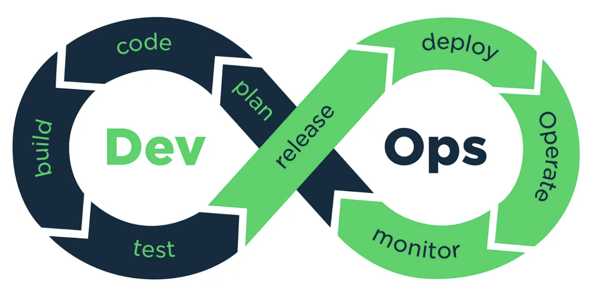

ในฝั่งของ Developers นั้นเราคงคุ้นเคยกันดีอยู่แล้วในการพัฒนาให้ได้ระบบออกมาให้ลูกค้าใช้งานนะครับ

แต่คำถามคือ แล้วในฝั่งของ Operations ละ ระบบของเรามีบริการอะไรที่ช่วยให้ลูกค้ามั่นใจได้ว่าระบบเราทำงานได้อย่างมีประสิทธิภาพและรองรับการขยายทางธุรกิจของลูกค้าได้จริงๆ

### **SLA คืออะไรหว่าา….**

**SLA** ย่อมาจาก “**Service Level Agreement**” ซึ่งเป็นสัญญาหรือข้อตกลงระหว่างผู้ให้บริการ (Service Provider) กับลูกค้าหรือผู้ใช้บริการ (Customer/Client) โดยกำหนดรายละเอียดเกี่ยวกับสิ่งที่ลูกค้าสามารถคาดหวังได้จากบริการนั้นๆ และมักจะรวมถึงมาตรฐานการปฏิบัติหรือ “Service Levels” ที่ผู้ให้บริการจะต้องปฏิบัติตาม เช่น ระยะเวลาตอบสนอง คุณภาพของบริการ และวิธีการวัดผล

หากผู้ให้บริการไม่สามารถปฏิบัติตาม SLA ได้ อาจมีบทลงโทษหรือการชดใช้ค่าเสียหายตามที่ได้กำหนดไว้ในข้อตกลง ซึ่งสามารถรวมถึงการคืนเงิน การให้บริการเพิ่มเติมฟรี หรือข้อตกลงอื่นๆ ที่เกี่ยวข้อง

ซึ่ง…. ใน VPS ที่ผมใช้นั้น ผมไม่สามารถทราบได้เลยว่าผมจะคำนวนค่า SLA ได้อย่างไร ทั้งที่เป็นตัวเลขที่สำคัญมากๆในการให้บริการผู้ใช้งาน

### **Scalability ละทำยังไง…**

Scalability หรือ “ความสามารถในการขยายระบบให้รองรับกับปริมาณการใช้งานของผู้ใช้” นั้น สำหรับ VPS ผมแทบจะเรียกว่าไม่สามารถตอบสนองได้อย่างรวดเร็ว เพราะทุกครั้งที่ผมจะทำการเพิ่มขนาดของ VPS ที่ผมใช้ (เช่น Ram, CPU) ผมต้องทำเรื่องเปิด Ticket เพื่อขอขยายขนาดและจ่ายค่าใช้จ่ายที่เพิ่มขึ้นซึ่งกินเวลานาน ทำให้ผมไม่สามารถเพิ่มลดได้ตามที่ต้องการ ต้องคำนวนลองหน้าเสมอ

### **Security ได้มาตราฐานอะไรบ้าง**

VPS ที่ผมใช้ ไม่ได้มีเอกสารรองรับการใช้งานที่ระบุได้ว่ามีระบบการดูแลทางด้านความปลอดภัยที่ได้มาตราฐานที่ลูกค้าต้องการ เช่น SOC 2 Compliance ทำให้ถ้าผมเจอข้อจำกัดที่ต้องรองรับมาตราฐานนี้ ผมก็จะไม่สามารถทำได้เลยครับ

### **Monitoring Tools ละมีไหม**

ในตอนที่ผมใช้ VPS นั้น ผมไม่ทราบเลยว่า Server นั้นใช้ CPU/ Memory ไปเท่าไหร่แล้ว รวมถึงถ้าผมต้องการจะเพิ่มขนาดให้ระบบรองรับการใช้งานได้มากขึ้นก็ต้องใช้เวลาประมาณนึง ให้บริษัทที่เขาดูแลเพิ่มให้ ซึ่งเราไม่สามารถทำได้เองเลย และยังมีอีกหลายคำถามตาม Meme ข้างล่างนี้นะครับ

> หลังจากเจอคำถามไปจุกๆแล้ว ก็เริ่มทำให้ผมหันมาให้ความสนใจกับบริการในรูปแบบของ Cloud Computing ที่จะเข้ามาช่วยตอบคำถามต่างๆเหล่านี้ได้ครับ ว่าแล้วก็เกียมตัว ไปดูกันต่อดีกว่าาา
> 

## **What is cloud computing?**

คือบริการให้เช่าทรัพยากรบนคอมพิวเตอร์โดยที่เราจ่ายเงินค่าบริการเท่าที่ใช้ตามจริงเท่านั้น ตัวอย่างบริการก็เช่น

- **Compute Power** เช่น Linux Servers และ Web Applications
- **Storage** เช่น ไฟล์, ฐานข้อมูล
- **Networking** เช่น การเชื่อมต่ออย่างปลอดภัยระหว่าง Cloud Provider และผู้ใช้
- **Analytics** เช่น Visualizing Telemetry และ Performance Data

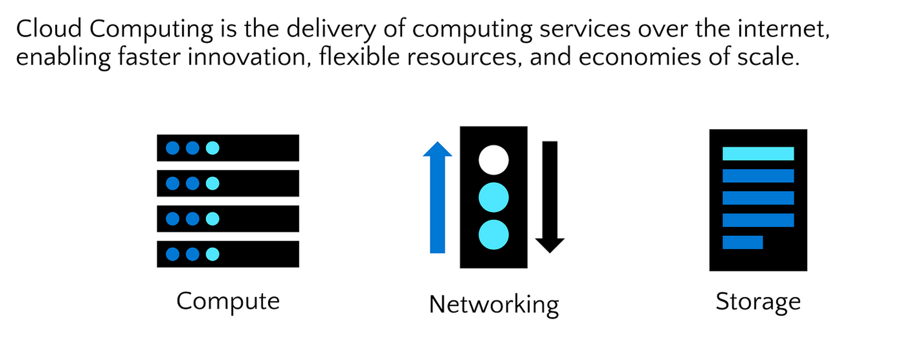

เช่าใช้ Compute / Networking / Storage เอ้ะ ยังไงหว่า

ในภาพข้างล่างนี้เราจะเห็นภาพมากขึ้นนะครับ ว่าเราทำการเช่าใช้บริการดังต่อไปนี้ผ่าน Internet เป็นต้น

- ระบบ File Server
- ระบบ Web Server
- ระบบฐานข้อมูล
- ระบบการยืนยันตัวตน
- ระบบการตรวจสอบต่างๆ

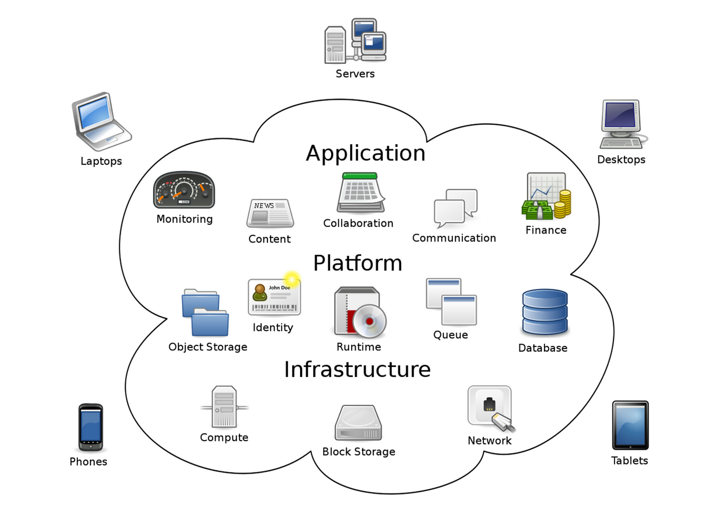

## **What is a cloud service provider?**

องค์กร NIST หรือ “National Institute of Standards and Technology” ซึ่งเป็นหน่วยงานของรัฐบาลสหรัฐอเมริกา มีหน้าที่ในการกำหนดมาตรฐานและเทคโนโลยีเพื่อส่งเสริมนวัตกรรมและความแข็งแกร่งทางเศรษฐกิจ

NIST คุณสมบัติของ Cloud Service Providers ไว้ 5 ข้อดังนี้นะครับ

1. `On-demand self-service` ผู้ใช้งานสามารถที่จะ Provision Servers หรือบริการต่างๆได้ด้วยตัวเองโดยไม่ต้องรอให้ทีมงานจาก Cloud แต่ละเจ้ามาดำเนินการให้
2. `Broad network access` มีระบบเครือขายที่กว้างขวาง มีมาตราฐาน สามารถเข้าถึงได้จากอุปกรณ์ไม่ว่าจะขนาดเล็กหรือใหญ่ (เช่น โทรศัพท์มือถือ แท็บเล็ต แล็ปท็อป)
3. `Resource pooling` บริการที่ใช้งานในรูปแบบ Multi-Tenant ที่เปิดโอกาสให้หลายๆบริษัทสามารถเข้ามาใช้บริการในรูปแบบเดียวกันได้
4. `Rapid elasticity` มีความยืดหยุ่นในการเพิ่มลดขนาดของบริการที่ใช้ได้อย่างรวดเร็วตามความต้องการของผู้ใช้
5. `Measured Service` ทุกบริการที่ใช้ต้องสามารถตรวจวัดและควบคุมปริมาณการใช้งานได้ทั้งหมด

> ศึกษารายละเอียดเพิ่มเติมได้ที่นี้นะครับ
> 

https://nvlpubs.nist.gov/nistpubs/legacy/sp/nistspecialpublication800-145.pdf

## **Consumption-based model**

การใช้งาน Cloud Computing จะอยู่ในรูปแบบ Pay as you go นะครับ หรือก็คือจ่ายเท่าที่เราใช้งานจริง ซึ่งช่วยให้เราประเมินค่าใช้จ่ายได้ล่วงหน้าแบ่งแยกตามแต่ละบริการ

## **Economies of Scale**

เป็นจุดเด่นของ Cloud Computing ที่ช่วยลดต้นทุนแต่ได้ผลลัพธ์ที่มากขึ้นในการดำเนินกิจการ โดยจะมีแผนการลงทุนสองรูปแบบที่เกี่ยวข้องได้แก่

**Capital Expenditure (CapEx)**

เป็นการลงทุนค่าใช้จ่ายโดยทั่วไปของ On-Premises Data Center ที่ต้องลงทุนล่วงหน้าไปกับ Physical Infrastructure ซึ่งจะมีค่าใช้จ่ายล่วงหน้าที่สูงมาก เพราะต้องลงทุนกับ Server, Storage, Network, Backup, Disaster Recovery, Data Center Infrastructure และยังต้องการผู้เชี่ยวชาญในการดูแลอีกด้วยครับ

> ข้อดีของ CapEx คือทราบตัวเลขการลงทุนที่ชัดเจนว่าจะต้องจ่ายแค่ไหนและเมื่อไร เพราะสามารถวางแผนค่าใช้จ่ายได้ล่วงหน้าตั้งแต่เริ่มโครงการ หรือจะวางแผนตามรอบระยะเวลางบประมาณ
> 

**Operational Expenditure (OpEx)**

เป็นการลงทุนค่าใช้จ่ายบน Cloud Computing ซึ่งเป็นการลงทุนกับสินค้าและบริการเท่าที่ได้ใช้งานและไม่มีค่าใช้จ่ายล่วงหน้าเหมือน CapEx

ค่าบริการมีได้หลายรูปแบบ เช่น เรียกเก็บตามจำนวนผู้ใช้งาน, ตามระยะเวลาที่ใช้งาน CPU, RAM, IOPS หรือตามปริมาณพื้นที่จัดเก็บข้อมูล รวมไปถึงการคิดค่าบริการตามจำนวน bandwidth ที่ใช้ทั้งนี้ เช่น backup traffic และ data recovery traffic

เราจำเป็นต้องหมั่นตรวจสอบการใช้บริการอยู่เสมอ เพื่อให้ทรัพยากรได้ถูกใช้งานอย่างเต็มที่ไม่สูญเปล่าเพื่อประหยัดต้นทุนให้ได้มากที่สุด

> ข้อดีของ OpEx คือ ความสามารถในการปรับเปลี่ยนบริการให้สอดคล้องกับความต้องการที่เปลี่ยนแปลงทางธุรกิจที่มีความผันผวนได้เป็นอย่างดี สามารถทดลองใช้บริการบางอย่างเพื่อทดลองและสามารถยกเลิกได้เมื่อเสร็จสิ้น เพิ่มค่าใช้จ่ายเมื่อมีบริการที่ต้องการสูงขึ้น และลดได้เมื่อมีความต้องการที่ลดลง
> 

แตกเงินก้อนใหญ่มาเป็นก้อนเล็กๆแทนดีกว่าน้าาาา

## **Cloud Deployment Models**

อีกคำศัพท์ที่ควรเรียนรู้ไว้ในเรื่องใช้งาน Cloud Computing ครับผม เพราะเป็นการที่เราต้องเลือกว่าจะใช้บริการในรูปแบบไหนที่จะตอบโจทย์กับนโยบายขององค์กรของเราที่สุด โดยเฉพาะเรื่องของความปลอดภัยในการดูแลรักษาข้อมูลครับ

### **Public Cloud**

เป็นรูปแบบบริการที่นิยมมากที่สุด เพราะลูกค้าไม่ต้องดูแล Hardware เอง ให้ Cloud Provider เป็นผู้ดูแลและปรับปรุงให้ระบบทันสมัยอยู่ตลอดเวลา เข้าถึงด้วย Internet ช่วยลดต้นทุนโดยการแชร์ทรัพยากรกับผู้ใช้บริการรายอื่นๆ ด้วย

> ข้อดีของ Public Cloud คือ จ่ายค่าบริการตามการใช้งานจริง ไม่มี CapEx (ค่าใช้จ่ายล่วงหน้า), เราไม่ต้องรับภาระในการบำรุงรักษาหรืออัปเดตฮาร์ดแวร์ ทำให้ได้ ความสามารถในการปรับขนาดของบริการได้อย่างรวดเร็ว, ไม่จำเป็นต้องมีความรู้ในการติดตั้งและใช้งานมากนัก

ตัวอย่างเช่น AWS, Azure, Oracle Cloud, Google Cloud

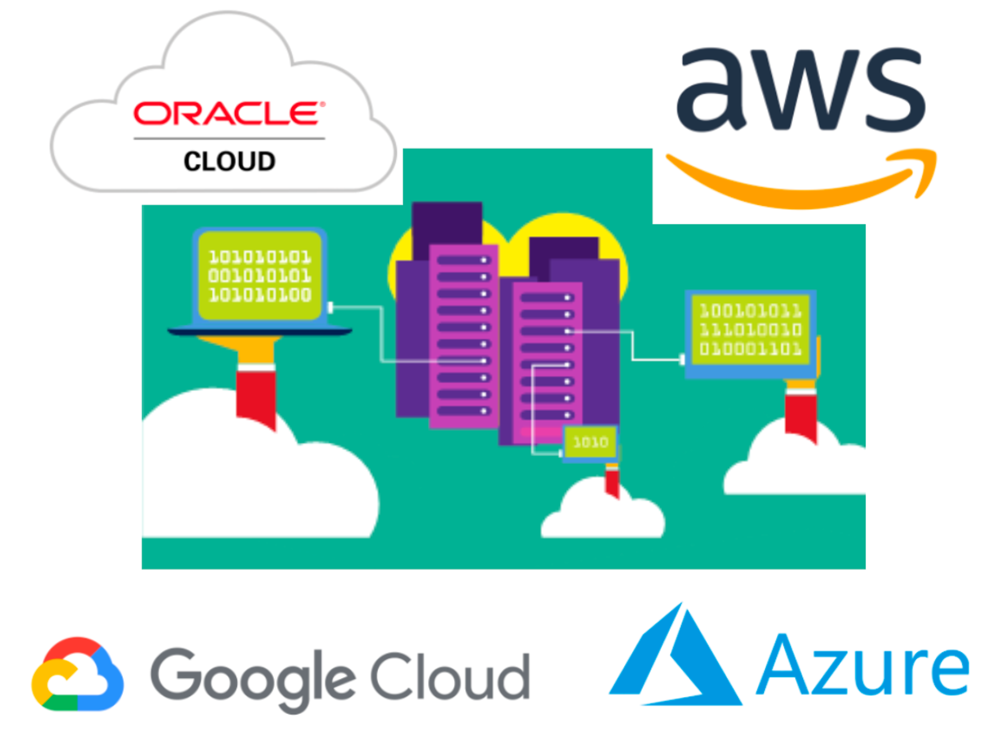

### **Private cloud**

เราติดตั้ง Cloud Environment ลงใน Data-center ของเราเอง จัดการกำหนดสิทธิการเข้าถึงทรัพยากรเพื่อใช้ภายในองค์กรของเรา โดยเราต้องรับภาระเพิ่มเติมในการการจัดซื้อและบำรุงรักษา Hardware และ Software

> ข้อดีของ Private Cloud คือ รองรับการทำงานในองกรณ์ได้เต็มที่, เชื่อมต่อด้วย Network ภายใน, ควบคุมจัดการทรัพยากรได้มาก, ทรัพยากรไม่ได้ถูกแบ่งกับบุคคลหรือองค์กรภายนอก
> 

ตัวอย่างบริการที่สามารถนำไปติดตั้งเป็น Private Cloud ได้ก็เช่น Azure Stack, Openstack, Red Hat Openshift, VMware vCloud เป็นต้นครับ

### **Hybrid cloud**

เป็นรูปแบบผสมระหว่าง Public และ Private Cloud เพื่อปรับใช้ทรัพยากรที่ตอบโจทย์ขององค์กร

เช่น ในกรณีที่เราไม่สามารถนำข้อมูลบางอย่างขึ้น Public Cloud ได้เนื่องด้วยข้อจำกัดด้านกฎหมาย เช่น เรามีข้อมูลทางการแพทย์ที่ไม่สามารถเปิดเผยต่อสาธารณะได้ทำให้เราจำต้องเก็บไว้ในฐานข้อมูลส่วนตัวเท่านั้น เราจึง Host Web Application บน Public Cloud แต่เชื่อมต่อมายัง Database ที่มีความปลอดภัยสูงที่อยู่ใน Private Cloud ของเรา

> ข้อดีของ Hybrid Cloud คือ มีทางเลือกในการควบคุมต้นทุน (Economies of Scale) โดยเลือกใช้ Public Cloud ในกรณีที่ต้นทุนที่ต่ำกว่า หรือใช้ Private Cloud ในกรณีที่ Public Cloud มีต้นทุนที่สูงกว่า, รวมไปถึงการควบคุมด้าน Security, Compliance และ รองรับ Legacy Applications ขององค์กร
> 

ตัวอย่างบริการเช่น Azure Arc Enabled Servers, Google Cloud Anthos, AWS Outposts

## **Cloud Benefits**

หุหุหุ ชอบหัวข้อนี้ที่สุดครับ เพราะเหมือนเราได้ป้ายยา แนะนำข้อดีการใช้งาน Cloud Computing ให้เห็นได้ชัดเจนขึ้นครับ

### **High availability**

สิ่งนึงที่มั่นใจได้จากการใช้งาน Cloud Computing คือเรื่อง High Availability เลยครับผม เพราะว่าทุกๆบริการที่มีนั้น มีการระบุ SLAs ทั้งหมด ทำให้เรามั่นใจได้ว่าโอกาสที่บริการจะใช้งานไม่ได้นั้นน้อยมากๆครับ

การนำ SLAs ในแต่ละบริการมาใช้ร่วมกันนั้นทำให้เกิดการคำนวนหา SLAs สุทธิ ซึ่งเราเรียกว่า Composite SLAs

ตัวอย่างเช่น นำ SLAs 99.95% มาใช้ร่วมกันกับบริการ SLAs 99.99% จะได้ผลลัพธ์ดังนี้

> (SLAs 99.95%) x (SLAs 99.99%) = SLAs 99.94%
> 

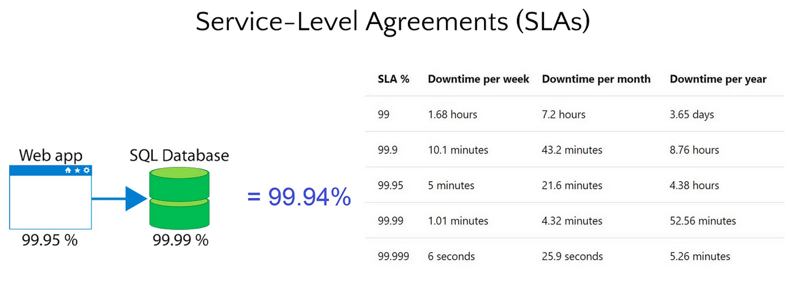

ศึกษาเรื่อง SLA ของ Microsoft Azure ได้ที่นี้นะครับ

[Licensing DocumentsThe Service Level Agreements (SLA) describe Microsoft's commitments for uptime and connectivity for Microsoft Online](https://www.microsoft.com/licensing/docs/view/Service-Level-Agreements-SLA-for-Online-Services?lang=1&source=post_page-----571b767a363f--------------------------------)

### **Scalability**

อีก 1 สิ่งที่ดีงามมากๆในการใช้ Cloud Computing คือเรื่องของทรัพยากรที่มีให้ใช้ค่อนข้างมากครับผม เราสามารถที่จะพยายามระบบได้ทั้งแบบ แนวตั้ง (Scale Up) เช่นการเพิ่ม CPU/ Memory หรือขยายแบบแนวนอน (Scale Out) เช่นการเพิ่มจำนวนของ Servers ในการประมวลแบบขนานกันครับ

ซึ่งการขยายแบบแนวนอน (Scale Out) นั้นเรายังสามารถตั้งเงื่อนไขให้เกิดการขยายได้แบบอัตโนมัติ หรือที่เรียกว่า Auto Scale Out ได้ด้วยนะครับ ลองดูในตัวอย่างข้างล่างจะเห็นว่าผมกำหนดไว้ว่าถ้า CPU ใช้งานเกิน 80 % ให้เพิ่ม 1 Instance

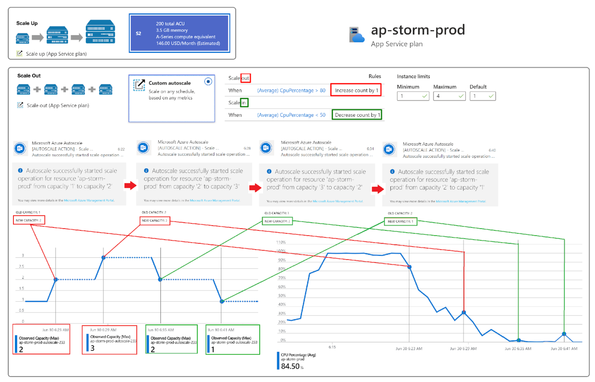

### **Reliability**

การใช้งานบน Cloud Computing ช่วยเพิ่มความทนทานให้กับระบบเราได้อีกมายเลยครับ เพราะว่าบริการส่วนใหญ่จะมีตัวเลือกที่ช่วยเพิ่มการสำรองข้อมูลไว้เพื่อป้องกันในกรณีที่เครื่องที่เราใช้นั้นเกิดความเสียหายขึ้นครับ โดยเราสามารถสำรองได้ทั้งใน Datacenter เดียวกัน, ส่งต่อไปสำรองยัง Datacenter อื่นที่อยู่ใน Region เดียวกัน หรือ Region อื่นได้ด้วยนะครับ ลองดูภาพข้างล่างประกอบจะเข้าใจมากขึ้นฮะ

ป้องกันได้ทั้งแบบ Server พัง, Datacenter พัง, Region พัง !! โหดจัด

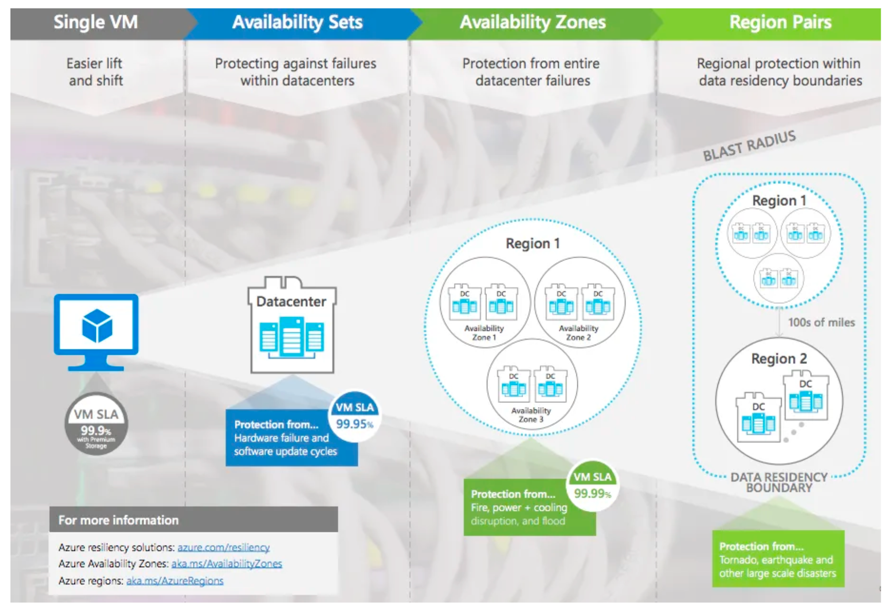

### **Predictability**

เนื่องจากคุณสมบัติของ Cloud Computing นั้นเราสามารถวัดและตรวจสอบปริมาณการใช้งานบริการต่างๆได้อย่างละเอียดครับ ทำให้เราสามารถที่จะประเมินค่าใช้จ่ายที่จะเกิดขึ้นในแต่ละเดือนได้ล่วงหน้าครับ ช่วยให้เราควบคุมค่าใช้จ่ายได้อย่างมีประสิทธิภาพครับ

### **Security**

ความปลอดภัยเป็นสิ่งที่สำคัญลำดับต้นๆในธุรกิจเลยครับ ซึ่ง Cloud Service Provider ทุกเจ้าก็พึงระวังและมีแนวทางที่มีมาตราฐานในการจัดการให้กับเราตั้งแต่เริ่มใช้งานเลยครับ ผมขออนุญาตยกตัวอย่าง Defense-In-Depth ของ Azure ซึ่งเป็นแนวทางในการสร้างความปลอดภัยโดยแบ่งออกเป็น 7 ขั้นดังนี้นะครับ

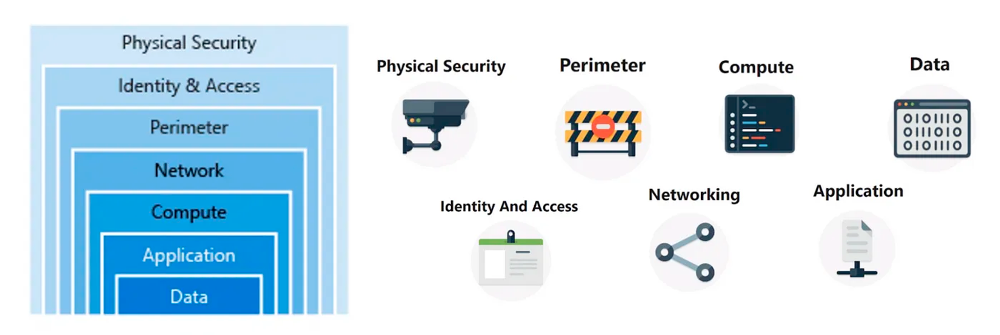

- **Physical**: Microsoft เป็นคนดูแลและจัดการรักษาความปลอดภัยในส่วนของ Data Center โดยคนทั่วไปไม่สามารถเข้า Data Center ของ Microsoft ได้ครับ
- **Identity & Access:** เพื่อระบุว่าคนๆนั้นมีตัวตนเพื่อมอบสิทธิในการเข้าถึงบริการต่างๆที่กำหนดไว้
- **Perimeter:** คือการป้องกันไม่ให้ผู้ใช้หรือระบบภายนอกสามารถเข้าถึงระบบของเรา เช่น การเลือกใช้ Firewall ในการเปิด Port บน Server หรือ Azure Application Gateway ในการจัดการกับการยืนยันตัวตน
- **Network:** คือการดูแลโครงข่ายในระบบเช่น Azure Virtual Network สำหรับการจัดการ Network ให้กับ VMs, VPN Site-to-Site เพื่อเชื่อม Network On-Premise กับ Network Azure
- **Compute:** คือการดูแลความปลอดภัยในระดับ Compute Service เช่น การ Config NSG เพื่ออนุญาตให้ เข้าถึง Azure VMs ได้บาง Port
- **Application:** คือเราป้องกันในระดับ Application ของเราอย่างไร เช่นการเก็บข้อมูลที่เป็นความลับของระบบ เช่น Database Connection ไว้ใน Server เท่านั้น
- **Data:** คือเราดูแลความปลอดภัยข้อมูลของเราอย่างไร เช่นการเข้ารหัสข้อมูลที่ใช้งาน

### **Governance**

เราสามารถกำหนดนโยบายการใช้งานบริการบน Cloud Computing เพื่อให้เรามั่นใจได้ว่าทีมงานใช้งานในรูปแบบเดียวกันกับนโยบายที่บริษัทกำหนดนะครับ

ผมขอยกตัวอย่างการใช้งานบน Azure นะครับ

ทำการออกแบบ Policy เพื่อให้ผู้ใช้งานสร้าง Azure Resources บนมาตราฐานที่องค์กรกำหนดไว้ และ ออกแบบ Access Control เพื่อจัดการกับสิทธิในการเข้าถึง Azure Resources โดยเราจำเป็นต้องรู้ Requirements ให้ครบก่อนถึงจะสามารถออกแบบ Governance and Compliance ได้

ตัวอย่าง Policy เช่น การควบคุมการสร้าง Azure VM ได้เฉพาะ Size ที่กำหนด และ Region ต้องเป็น Southeast Asia เท่านั้น, Web ต้องเป็น HTTPS เท่านั้น, VM ต้องติดตั้ง Antivirus

ตัวอย่าง Access Control เช่นให้สิทธิผู้ใช้บางคนในการเข้าถึง Resource Group, Subscription

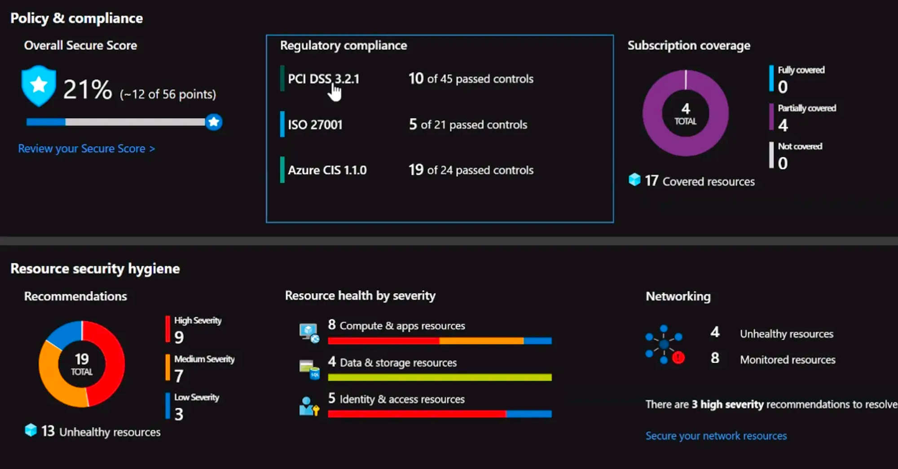

### **Azure Service Compliance**

> แถมเพราะอยากให้เห็นตัวอย่างว่า Cloud Service Provider ทุกเจ้าจริงจังกับเรื่องการรักษาความปลอดภัยมากๆ เราสามารถนำข้อมูลต่างๆเหล่านี้ใช้อ้างอิงเพื่อเพิ่มความน่าเชื่อถือให้กับระบบเราได้มากเลยครับ
> 

เป็นช่องทางในการสืบค้นหาข้อมูลว่าบริการต่างๆบน Azure นั้นสอดคล้องกับ Compliance ขององค์กรต่างๆหรือไม่ เช่น GDPR, ISO โดยจะประกอบด้วยบริการดังนี้

- [Microsoft Privacy Statement](https://privacy.microsoft.com/en-us/privacystatement) เพื่อแจ้งวัตถุประสงค์ของการขอข้อมูลลูกค้าที่ใช้บริการ Azure เพื่อความโปร่งใสและมั่นใจได้ว่า Microsoft ไม่นำข้อมูลของลูกค้าไปเปิดเผยต่อแน่นอน
- [Microsoft Trust Center](https://www.microsoft.com/en/trust-center)** เป็นช่องทางในการค้นหารายละเอียดของ บริการใน Azure ที่เกี่ยวข้องกับ Security, Privacy และ Compliance
- [Service Trust Portal (STP)](https://servicetrust.microsoft.com/) ดู Audit Reports ว่าบริการของ Azure นั้น Comply Data Protection Standards และผ่านมาตราฐานจาก Regulator ต่างๆได้ เช่น SOC, FedRAMP, ISO 27001, PCI/DSS
- [Compliance Manager](https://servicetrust.microsoft.com/ComplianceManager) เป็น Risk Assessment Tool แบบ Workflow คือจะมีบริการเป็นขั้นตอนให้เราเลือกเพื่อวิเคราะห์ว่าบริการบน Azure ที่เราติดตั้งอยู่นั้นตรงกับ Compliance หรือไม่ โดยเราจะเห็นคะแนน Assessment ออกมาครับ
- [Microsoft compliance offerings](https://learn.microsoft.com/en-us/compliance/regulatory/offering-home)** Azure ****จริงจังกับเรื่องการของบริการที่ตอบรับกับ Compliance ต่างๆในระดับสากล ตัวอย่างเช่น GDPR ในสหภาพยุโรป, HIPAA, ISO และยังรวมไปถึง PDPA ของประเทศไทยด้วยน่ะครับ

### **Manageability**

เราสามารถจัดการกับบริการ Cloud Computing ได้หลายช่องทางไม่ว่าจะเป็น Web Application, Mobile Application และ Command Line น่ะครับ ผมขอยกตัวอย่างของ Azure. ดังนี้

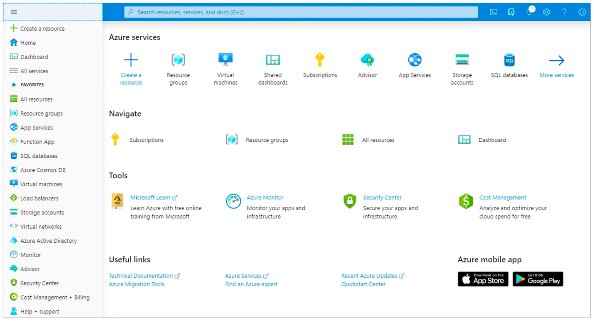

[Website portal.azure.com](https://portal.azure.com/)

Command Line

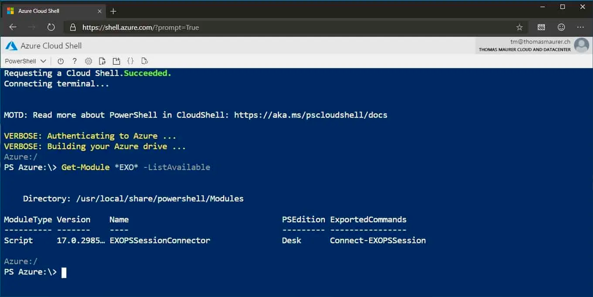

Command Line บน Website https://portal.azure.com/#cloudshell/

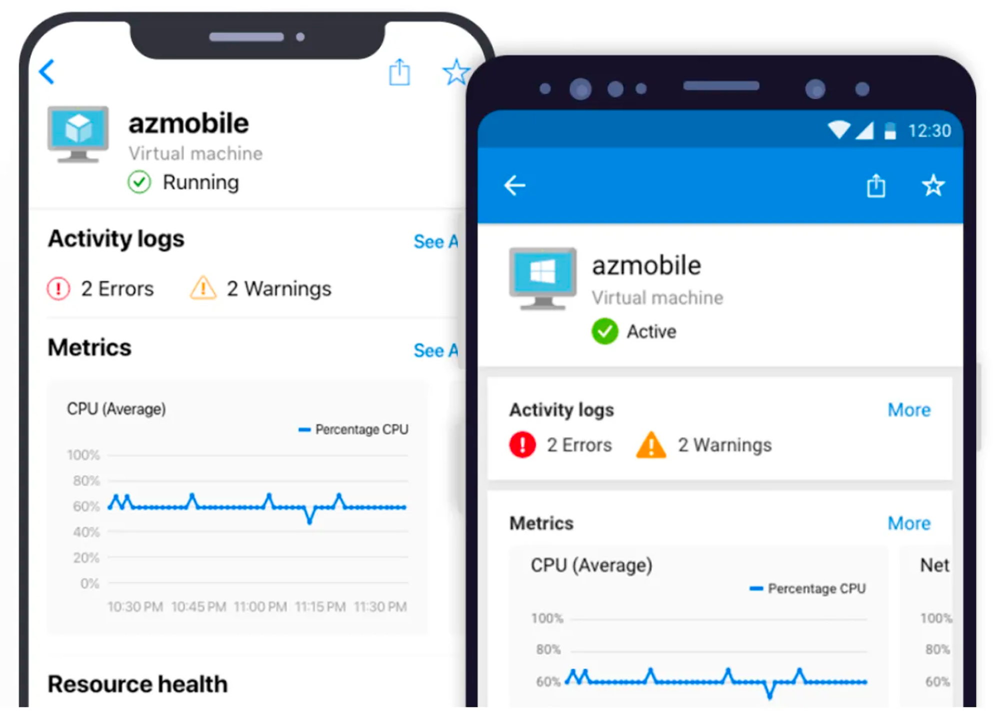

จัดการผ่านมือถือก็สะดวกสุดดด

## **Cloud Service Models**

Meme ในตำนานต้องเข้าแล้ว ฮาๆ Who is responsible for cloud computing?

### **Shared responsibility model**

ความปลอดภัยในการใช้ Cloud นั้นเป็นหน้าที่ความรับผิดชอบร่วมกันทั้งผู้ให้บริการและผู้ใช้บริการครับ จึงเป็นที่มาของคำว่า Share Responsibility

Cloud Service Model จึงเป็นปัจจัยสำคัญ (IaaS, PaaS, SaaS) เพราะเป็น Model ที่บอกถึงความรับผิดชอบของผู้ให้บริการและผู้ใช้บริการอย่างชัดเจน

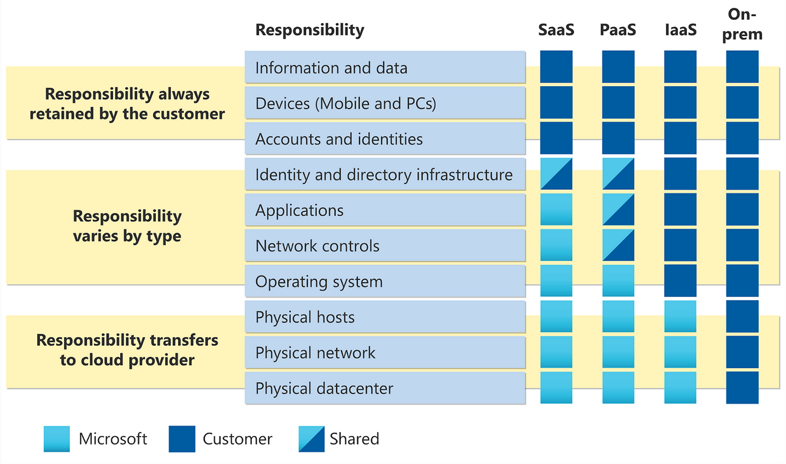

ภาพจาก [docs.microsoft.com](https://docs.microsoft.com/learn/modules/describe-cloud-compute/4-describe-shared-responsibility-model) ซึ่งเราจะพบว่า IaaS สามารถควบคุมได้มากสุด (แต่ก็แลกมากด้วยเวลาและค่าใช้จ่ายในการดูแลรักษาที่เยอะกว่า) จนมาถึง SaaS ที่ควบคุมได้น้อยแต่ใช้งานได้เร็วครับ

**On-Premise**

เราจะต้องดูแลทุกอย่างเองทั้งหมด ทั้ง Hardware และ Software เช่น จะตั้งค่า Network ยังไง จะ Patch OS เมื่อไหร่ ติดตั้งโปรแกรมอะไรบ้าง ไฟดับ เน็ทหลุด harddisk เสีย ต่างๆ ซึ่งปัญหาพวกนี้เราต้องดูแลเองทั้งหมดเลย

### **Infrastructure as a Service (IaaS)**

https://docs.microsoft.com/learn/modules/describe-cloud-compute/6-describe-consumption-based-model

เป็นรูปแบบการให้บริการพื้นฐานบน Cloud Cumputing เหมาะสำหรับสถานะการณ์ที่เราอยากจะได้เครื่องเซิฟเวอร์ไปใช้งาน แต่ให้ Cloud Provider เป็นผู้ดูแล Physical Infrastructure โดยเราจะเน้นไปที่ความยืดหยุ่นในการใช้งานที่มากที่สุด เช่นเราสามารถจัดการได้ว่าจะ Patch OS เมื่อไหร่ จะติดตั้งโปรแกรม หรือลง Antivirus โดย

เป็นรูปแบบที่ย้ายจาก On-Premises มาง่ายที่สุด (“Lift & Shift”)

> ตัวอย่างบริการ: Container Service, Virtual Machines, Azure Storage Accounts
> 

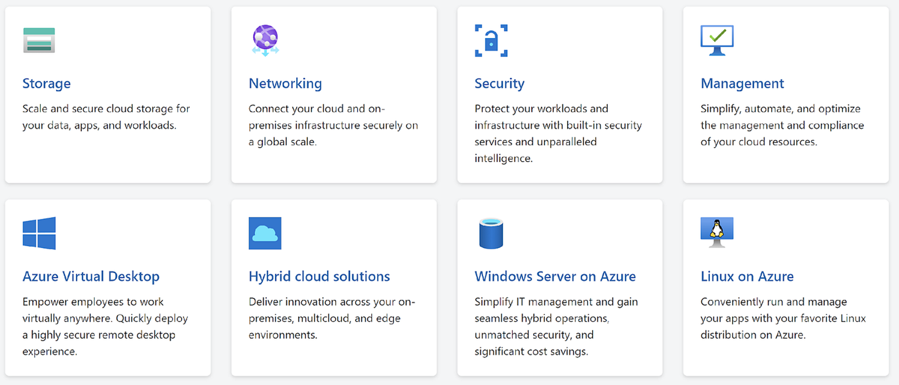

### **Platform as a Service (PaaS)**

https://docs.microsoft.com/learn/modules/describe-cloud-service-types/3-describe-platform-service

เป็นบริการมุ่งเน้นไปที่การอำนวยความสะดวกให้ผู้ใช้บริการสามารถสร้างแอปพลิเคชันได้อย่างรวดเร็ว โดยไม่ต้องกังวลกับ Infrastructure เพราะเราเน้นดูแค่ โปรแกรมและข้อมูลที่ใช้ ส่วนอื่นๆทาง Cloud Service Provider จะเป็นคนดูแลให้ครับ เช่น Windows เราก็ไม่ต้องคอย update หรือ จัดการกับความปลอดภัยต่างๆด้วยตัวเราเอง

> ตัวอย่างบริการ: Azure App Service, Azure SQL Database, Azure Functions
> 

ตัวอย่าง Azure App Service ที่ช่วยให้เราติดตั้งระบบได้สะดวกมากครับ

Azure Application Insight เป็น Combination Tools ร่วมกับ Azure App Service ทำให้เราตรวจสอบการใช้ระบบได้อย่างมีประสิทธิภาพและติดตั้งง่ายมากๆครับ

### **Software as a Service (SaaS)**

https://learn.microsoft.com/en-gb/training/modules/describe-cloud-service-types/4-describe-software-service

เป็นบริการที่มีไว้เพื่อเน้นให้ End Customer ใช้งานโปรแกรมที่อยู่บน Cloud Computing อย่างเดียวเท่านั้น ดังนั้นในระดับนี้เราจะไม่ต้องไปยุ่งอะไรกับการตั้งค่าเลย

> ตัวอย่างบริการ: Dynamics 365, Outlook, Office 365
> 

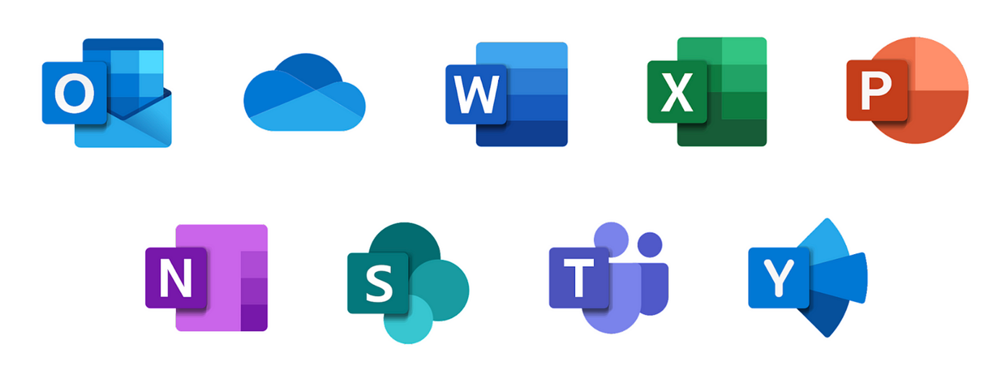

### **Cloud Service Models Comparison**

ไม่ว่าจะใช้ Service Model แบบไหน สิ่งที่ผู้ใช้บริการต้องดูแลด้วยตัวเองอยู่เสมอนะครับ คือ

- ข้อมูลของเรา (Data)
- ดูแล Endpoint ให้ปลอดภัย เช่นถ้าเราเลือกใช้ Azure App Service เราจะดูแล Web Server ยังไง
- จัดการ User Account เอง, จัดการสิทธิในการเข้าถึง Resources ต่างๆที่เราสร้างขึ้น (Access Management, ACL)

ส่วนการเลือก Service Model จะมีผลกับความรับผิดชอบของเราที่มากขึ้นหรือน้อยลงนะครับ

สรุปเบาๆ กรุบกริบๆ พอให้เห็นภาพส่งท้าย

เช่น ถ้าเราเลือกบริการแบบ IaaS เช่น Azure VMs นั้นเราต้องดูแลตั้งแต่ OS เอง ทำให้เราต้องจัดการกับความปลอดภัยเอง เช่น การติดตั้ง Antivirus , ดูแล OS Security Patch เอง

แต่ถ้าใช้ PaaS เช่น Azure App Service นั้น Microsoft จะช่วยดูแลจัดการให้เราหมดเลยในระดับ OS ทั้ง Patching, Antivirus

### **ตัวอย่างเปรียบเทียบ On-premise กับ Azure / AWS ครับ**

อยากให้เห็นภาพการเลือกใช้แต่ละบริการมากขึ้น ผมเลยลองสร้างตารางมาเปรียบเทียบให้ดูนะครับว่าถ้าเป็นสาย .NET แล้วอยากเปลี่ยนจาก On-premises มาใช้ Azure หรือ AWS ต้องใช้บริการอะไรบ้างนะครับ

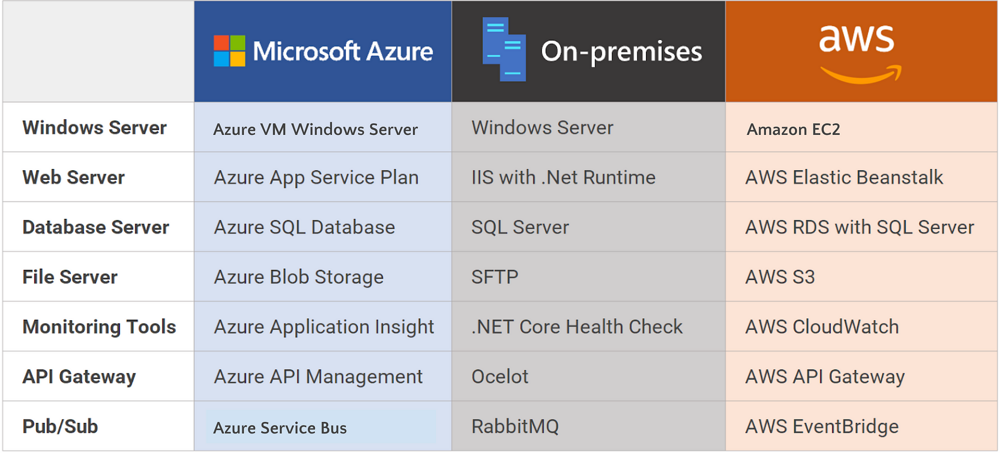

## **Knowledge Checking**

ก่อนจากกันเราลองเอาความรู้ที่ได้มาทดสอบกันข้างล่างนะครับ สนุกดี

- [Cloud Computing](https://learn.microsoft.com/en-gb/training/modules/describe-cloud-compute/7-knowledge-check?source=post_page-----571b767a363f--------------------------------)

- [Cloud Benefit](https://docs.microsoft.com/en-us/learn/modules/describe-benefits-use-cloud-services/6-knowledge-check?source=post_page-----571b767a363f--------------------------------)

- [Cloud Service Type](https://docs.microsoft.com/learn/modules/describe-cloud-service-types/5-knowledge-check?source=post_page-----571b767a363f--------------------------------)

## **สรุป**

หวังว่าผู้อ่านทุกท่านน่าจะพอมองเห็นภาพแนวทางการใช้งาน Cloud Computing กันเพิ่มมากขึ้นนะครับ 

ส่วนเราจะเลือกใช้เจ้าไหนก็เลือกได้ตามที่แต่ละท่านเห็นสมควรเลยครับผม 

อย่างน้อยๆถ้าเข้าใจคำศัพท์ต่างๆที่เกี่ยวข้องกับ Cloud Computing 

เช่น Public Cloud แตกต่างจาก Private / Hybrid Cloud ยังไง 

เท่านี้ผมก็ดีใจมากๆแล้วครับ เย้

